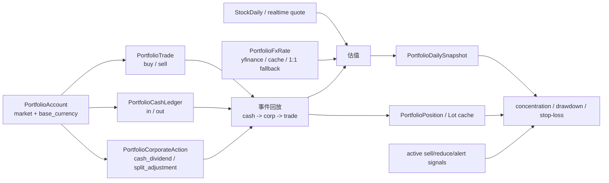

# v0.1.0 账户、持仓与投资组合真实性核验报告

> 任务：`RDSA-PORTFOLIO-TRUTH-AUDIT-007`  
> 核验日期：2026-07-12  
> 第一真相源：`D:\tmp\RuyiDailyStockAnalysis_v0.1.0` 与教学 ZIP  
> 对照仓库：`D:\quant\RuyiDailyStockAnalysis`（`dev` 只作差异对照）

## 1. 执行摘要

- 教学 ZIP SHA-256 为 `FA96F2E15082E12E8C92259CAFD1AE3E11B675DFED5C01752967248A2240B2FD`。ZIP 内 1006 个文件与教学目录逐文件核验：缺失 0、内容哈希不符 0；没有重新解压或覆盖教学目录。
- 教学代码精确对应仓库 `version/v0.1.0` 的 commit `4eb23fbb1242b773e789373e7035e570f7075798`（2026-07-10 20:18:32 +08:00），以该引用作为 `D:\tmp` 工作树执行 `git diff` 无跟踪文件差异。
- `v0.1.0` 确实实现了账户、交易、资金流水、现金分红、拆并股、FIFO/AVG 双成本法、持仓快照、多币种换算、集中度、回撤、止损接近度、券商 CSV 导入和 Web 页面；但“总收益”“仓位比例”“确定性综合风险评分”没有独立业务字段或公式。
- 教学数据库的 8 张 portfolio 表均为 0 条。现有教学运行只证明服务能启动、行情/分析链路运行过，不证明账户创建、交易、持仓、公司行为、CSV 正式导入或风险计算在教学数据库中真实操作过。
- 现有投资组合截图由 `D:\quant\RuyiDailyStockAnalysis` 运行目录生成；截图时 HEAD 仍为 `4eb23fbb`（与 `v0.1.0` 相同），但使用的是 `D:\quant\...\data\stock_analysis.db`，不是教学目录数据库。截图是空状态，API 只有 GET，没有业务 POST。因此它可作为“相同代码 commit 的页面可打开/空状态”证据，不可作为“教学目录完成真实持仓业务操作”的证据。
- 最小必要测试使用临时数据库执行：后端 93 项通过，前端 32 项通过；未污染教学数据库。
- `dev` 相对 `version/v0.1.0` 只有页面验收工具 commit `605fd015...`；portfolio 核心代码、API、Web 页面和 portfolio 测试没有提交级差异，当前不存在可宣称的 portfolio 业务修复或新增能力。

## 2. 教学目录与运行环境

### 2.1 完整性与版本

| 项目 | 结论 | 证据 |
| --- | --- | --- |
| 教学目录 | 完整 | ZIP 1006 个文件全部存在且哈希一致 |
| ZIP 修改 | 未发现 | 缺失 0、内容不符 0 |
| Git 元数据 | 教学目录无 `.git` | 通过开发仓库的 `version/v0.1.0` 引用反向映射 |
| 版本 commit | `4eb23fbb1242b773e789373e7035e570f7075798` | `refs/heads/version/v0.1.0` 与 `origin/version/v0.1.0` 同指该 commit |
| 运行新增文件 | 存在 | `.venv`、`apps/dsa-web/node_modules`、`static/` 构建产物、`.env`、SQLite/WAL、日志、报告 |

这些新增项是安装、构建与运行痕迹，不是 ZIP 原文件被修改。教学 `.env` 的本任务相关非敏感配置为 `STOCK_LIST=600519,300750,002594`、`DATABASE_PATH=./data/stock_analysis.db`；没有读取或记录密钥值。

### 2.2 数据、日志、入口与当前状态

- 数据库：`data/stock_analysis.db`，SQLite WAL；`stock_daily=43`，portfolio 八表均为 0。
- 日志：2026-07-10～2026-07-11 的分析日志、API 日志和 `course-api.*.log`；API 日志明确记录数据库为 `D:\tmp\RuyiDailyStockAnalysis_v0.1.0\data\stock_analysis.db`。
- 报告：`reports/report_20260711.md`，属于股票分析报告，不是账户/持仓业务报告。
- CLI：`python main.py` 及 `--debug`、`--dry-run`、`--stocks`、`--market-review`、`--schedule`。
- Web/API：`python main.py --webui`、`python main.py --webui-only`、`python main.py --serve-only`、`python webui.py`、`uvicorn server:app ...`。
- 前端：`apps/dsa-web` 的 Vite 应用；静态构建已生成到教学目录 `static/`。
- 当前运行状态：核验时 8000/4173/3000/8080 均无监听，教学服务已停止。
- 测试：教学 `.venv` 未安装 pytest，因此用标准库 `unittest` 执行 93 项；Vitest 32 项通过。

## 3. 截图和验收材料来源核验

| 维度 | 核验结论 |
| --- | --- |
| 生成时间 | 报告 UTC `2026-07-11T23:11:02.468Z`，即北京时间 2026-07-12 07:11:02；投资组合截图 07:10:45 |
| 运行目录 | `D:\quant\RuyiDailyStockAnalysis`，不是 `D:\tmp` 教学目录 |
| 代码版本 | 截图时 HEAD 为 `4eb23fbb`；reflog 显示直到 08:15 才从 `version/v0.1.0` 切到 `dev`。所以代码内容对应 `v0.1.0` |
| 截图工具 | 当时未提交的 `apps/dsa-web/e2e/page-audit.spec.ts`，后于 08:36/08:37 提交为 `605fd015` |
| 后端数据库 | 日志 06:57:27 明确为 `D:\quant\RuyiDailyStockAnalysis\data\stock_analysis.db` |
| 数据状态 | 投资组合八表当前均为 0；截图视觉为“还没有可用账户/当前无持仓数据/暂无流水”；同分钟 API 仅 GET |
| 行情方式 | 页面请求 `snapshot` 与 `risk` 均带 `include_realtime=false`，使用本地历史收盘价路径；空账户下未形成估值 |
| 验收范围 | 校验页面主文档、ready locator、console/page/request/API 错误和截图哈希；未执行账户创建、资金入金、买卖、分红、拆股、CSV 提交或删除 |
| 登录页 | `mode=mocked-login`，`/api/v1/auth/status` 被 Playwright mock；不能证明真实登录状态 |

投资组合截图结论：**同一 v0.1.0 commit 的空状态页面可打开证据**。它不是教学目录、教学数据库或真实业务成功状态证据，不能用于 PPT 声称“已真实完成持仓管理闭环”或“不是 Mock”。验收报告中的 `ok=true` 只表示页面通过该自动验收脚本。

## 4. 关键代码与模块映射

| 页面/能力 | API | Service/计算 | Repository/模型 | 主要测试 |
| --- | --- | --- | --- | --- |
| `/portfolio` 总览与持仓 | `GET /api/v1/portfolio/snapshot` | `PortfolioService.get_portfolio_snapshot`、`_replay_account`、`_build_positions` | `PortfolioRepository`；`PortfolioAccount/Trade/CashLedger/CorporateAction/Position/Lot/DailySnapshot/FxRate` | `test_portfolio_service.py`、`test_portfolio_api.py`、`PortfolioPage.test.tsx` |
| 账户 | `/portfolio/accounts` GET/POST/PATCH/DELETE | account CRUD；DELETE 为软停用 | `portfolio_accounts` | API 的创建、软删除、归档隐藏测试 |
| 交易 | `/portfolio/trades` GET/POST/DELETE | `record_trade`、超售校验、缓存失效 | `portfolio_trades` | FIFO/AVG、超售、并发、删除恢复 |
| 资金流水 | `/portfolio/cash-ledger` GET/POST/DELETE | `record_cash_ledger` | `portfolio_cash_ledger` | API 流程、删除和 busy 语义 |
| 公司行为 | `/portfolio/corporate-actions` GET/POST/DELETE | `record_corporate_action`、回放分红/拆股 | `portfolio_corporate_actions` | 分红拆股与同日顺序 |
| 汇率 | `/portfolio/fx/refresh` POST | `refresh_fx_rates`、`_convert_amount`、yfinance | `portfolio_fx_rates` | 关闭刷新、在线失败、stale fallback |
| 风险 | `/portfolio/risk` GET | `PortfolioRiskService` | daily snapshot + position cache + decision signal | 阈值、回填、跨币种集中度、降级 |
| CSV | `/portfolio/imports/csv/brokers|parse|commit` | `PortfolioImportService` | 最终逐行调用 `record_trade` | 券商、去重、前导零、预演、超售/忙碌 |

前端调用链为 `PortfolioPage.tsx → apps/dsa-web/src/api/portfolio.ts → api/v1/endpoints/portfolio.py → src/services/* → src/repositories/portfolio_repo.py → src/storage.py`。Web 不提供独立 CLI 持仓命令；CLI 主入口主要负责分析与服务启动。

## 5. 数据模型与业务关系

- 交易、资金流水、公司行为是源事件；position/lot/daily snapshot 是读取快照时重放并原子替换的派生缓存。
- 同日固定顺序是 `现金 → 公司行为 → 交易`。因此同日分红发生在同日交易之前：原有持仓可得分红，同日新买入不得分红。
- 仓位身份键为 `(symbol, market, currency)`；账户本身有默认 market/base currency，但 API 可以给交易单独指定 market/currency。

## 6. 现金、市值、权益和仓位

| 项目 | 代码/公式 | 输入→输出与数字例子 | 页面/测试 | 当前限制 |
| --- | --- | --- | --- | --- |
| 持仓数量 | `_replay_account`；买入 `+qty`、卖出 `-qty`、拆股 `×ratio` | 买 100、卖 30、2:1 拆股后为 140 股 | 持仓明细“数量”；分红拆股、部分卖出、超售测试 | 不处理股票分红、送股、配股、碎股现金替代 |
| 持仓市值 | `_build_positions`；`qty × last_price × FX` | 100 股×12 元=1200 CNY | 持仓明细“市值”、顶部“总市值”；价格来源测试 | 缺价时市值、成本基准值和浮盈亏都置 0，并标 `price_available=false` |
| 账户现金 | `_replay_account`；入金-出金-买入总额-买入费用税+卖出净额+现金分红，再换算基准币 | 入金 10000，买 100×10，分红 100×1，现金=9100 | 顶部“总现金”；公司行为测试断言 9100 | 不校验余额充足，可形成负现金；不同币种只在汇总时换算 |
| 账户权益 | `total_cash + total_market_value` | 现金 9100 + 市值 1200 = 10300 | 顶部“总权益”；公司行为测试断言 10300 | 不等于“总收益”；会受入金/出金直接改变 |
| 仓位 | **无独立后端字段/函数** | 若教学自行派生：市值 1200 / 权益 10300 = 11.65%，但这不是 v0.1.0 API 输出 | 页面没有“仓位%”字段 | 不得把集中度权重当仓位；集中度分母不含现金 |

## 7. 成本法、费用与部分卖出

实际支持两种可切换口径：`fifo` 与 `avg`。页面默认 FIFO，并允许切换 AVG；不是单一固定成本法。

- FIFO：买入时一笔一 lot，`unit_cost=(gross+buy_fee+buy_tax)/qty`；卖出按最早 lot 依次消耗。
- AVG：买入后 `total_cost += gross+buy_fee+buy_tax`，`avg_cost=total_cost/quantity`；卖出按当前平均成本分摊并减少剩余总成本。
- 卖出净收入：`gross-sell_fee-sell_tax`。
- 已实现盈亏：`卖出净收入-被消耗成本`。
- 全部卖出后 AVG 的 quantity 与 total_cost 归零；FIFO lot 被全部移除。超售在写入前拒绝。

真实测试例：先后买入 100×10（费 10）和 100×20（费 10），再卖 150×30（费 10、税 5），收盘价 25。

| 口径 | 卖出成本 | 已实现盈亏 | 剩余数量/成本 | 浮动盈亏 |
| --- | --- | --- | --- | --- |
| FIFO | 100×10.1 + 50×20.1 = 2015 | 4485-2015 = 2470 | 50 股，成本 1005，均价 20.1 | 50×25-1005 = 245 |
| AVG | 平均成本 3020/200=15.1；卖出成本 2265 | 4485-2265 = 2220 | 50 股，成本 755，均价 15.1 | 50×25-755 = 495 |

两种口径下权益相同，已实现/未实现的拆分不同；测试断言正是 FIFO `2470/245`、AVG `2220/495`。手续费和税费已进入现金与盈亏，同时 `fee_total/tax_total` 只是附加统计，讲课时不能再次从盈亏中扣除。

## 8. 浮动盈亏与已实现盈亏

| 项目 | 公式与函数 | 页面字段 | 测试证据 | 限制 |
| --- | --- | --- | --- | --- |
| 浮动盈亏 | `_build_positions`：`market_value_base-cost_base` | 每只持仓“浮动盈亏”；API 另有账户/组合汇总 | 实时价、历史价、FIFO/AVG、缺价测试 | 页面顶部不展示账户级浮盈；缺价持仓的浮盈按 0，不表示真实为 0 |
| 浮动收益率 | `unrealized/cost_base×100%` | 持仓“收益率” | stale close 10% 等测试 | 仅未实现收益率；不是总收益率 |
| 已实现盈亏 | `_replay_account`：`net_sell_proceeds-cost_basis`，按卖出日 FX 换基准币 | API `realized_pnl`；当前 Web 未展示 | FIFO/AVG 2470/2220 | 现金分红不计入已实现盈亏；FX 换算损益没有独立拆分 |
| 总收益 | **未实现独立公式/字段** | 无 | 无 | `realized+unrealized` 不含现金分红，也不是资金加权/时间加权收益；不能在 PPT 写成系统“总收益” |

若需要账户经济收益，可在后续版本定义 `权益-累计净入金` 或现金流加权/TWR/XIRR，但必须单独设计，不能从当前代码反推成既有功能。

## 9. 分红、拆股和公司行为

| 行为 | 现金 | 数量 | 成本 | 收益字段 | v0.1.0 状态 |
| --- | --- | --- | --- | --- | --- |
| 充值/提现 | `+amount/-amount` | 不变 | 不变 | 不计 realized/unrealized | 支持 cash ledger `in/out` |
| 买入 | 减 `gross+fee+tax` | 增加 | 买入费用与税进入成本 | 影响未来已实现/当前未实现 | 支持 |
| 卖出 | 增 `gross-fee-tax` | 减少 | FIFO/AVG 消耗成本 | 计入 realized | 支持 |
| 现金分红 | 增 `持有数量×每股分红` | 不变 | 不变 | **不计 realized** | 支持，未处理预扣税 |
| 拆股/合股 | 不变 | `×ratio` | 总成本不变；FIFO 单位成本 `/ratio`；AVG 总成本不变 | 不直接计收益 | `split_adjustment` 支持 ratio>0，含 ratio<1 合股 |
| 股票分红/送股/配股/权利发行 | - | - | - | - | 无专用 action type；不能宣称完整支持 |

测试例：入金 10000，买 100×10，每股现金分红 1，2:1 拆股，收盘 6，得到现金 9100、200 股、均价 5、市值 1200、权益 10300。当前没有股息税、除权记录日、碎股、现金替代或公司行为自动抓取。

## 10. 跨市场与汇率

- 账户/交易校验接受 `cn/hk/us/jp/kr/tw`；证券代码有 A 股前后缀、港股前导零和美股大写等归一化。
- 默认交易币种仅明确：`hk→HKD`、`us→USD`、其余→`CNY`。因此 JP/KR/TW 从 Web 手工录入且不显式传 currency 时会落为 CNY；Web 交易/公司行为表单没有 currency 输入。这与这些市场真实币种不一致。
- JP/KR/TW 被显式标为 `data_quality=partial`，限制包括实时行情尽力、汇率与成本口径部分、行业与风险覆盖有限。
- 汇率在线源为 yfinance 的 `<FROM><TO>=X`，查询 as-of 前后 7 天日线收盘；结果缓存于 `portfolio_fx_rates`。
- 快照不会自动在线刷新汇率；需手动 `POST /fx/refresh`。在线失败时复用最近缓存并以当天记录标 stale；完全无汇率时 `_convert_amount` 直接 1:1 返回并标 stale。
- `get_latest_fx_rate` 只取 `rate_date<=as_of` 最新行，不按缓存年龄自动判 stale；旧但标记非 stale 的行仍被当非 stale 使用。
- 全账户聚合固定换算为 CNY；单账户先换为账户 base currency。

结论：A/H/美股是主支持范围；JP/KR/TW 只可讲“接入但估值部分支持”。缺失汇率 1:1 是可用性降级，不是真实金融换算，PPT 必须明确警示。

## 11. 集中度、回撤和止损

| 指标 | 代码公式 | 数字例子 | 页面/测试 | 限制 |
| --- | --- | --- | --- | --- |
| 个股集中度 | `_build_concentration`：同 symbol 的 CNY 市值/组合总市值×100 | A 市值 700、B 300，A=70% | 饼图在板块不可用时回退个股；跨币种测试 | 分母不含现金；key 只用 symbol，跨市场同 ticker 可能合并 |
| 行业集中度 | `_build_sector_concentration`：行业 CNY 市值/总市值 | 白酒 800/1000=80% | 页面优先显示行业饼图；A 股板块测试 | 仅 CN 尝试板块；非 CN 为 `UNCLASSIFIED`，失败 fail-open |
| 最大回撤 | `_build_drawdown`：序列峰值 `peak`，`(peak-equity)/peak×100`，取最大 | 权益 10000→8000，回撤 20% | 页面最大/当前回撤；窗口回填测试 | 基于账户权益而非净值；入金/提现会扭曲回撤；按自然日回填并复用最近收盘，不是纯交易日收益序列 |
| 止损接近度 | `_build_stop_loss`：`max(0,(avg_cost-last_price)/avg_cost×100)`；默认 10%，near=8% | 成本 100、现价 91，loss=9%，near 是、trigger 否 | 页面仅显示计数；阈值边界测试 | 不是用户设置的止损价距离；盈利时固定 0；页面不展示逐项距离 |
| 风险信号 | 当前持仓 active `sell/reduce/alert` DecisionSignal 数量 | 1 sell+1 reduce=2 | 页面“AI 风险信号”；fail-open 测试 | 没有确定性综合 risk score；信号服务失败只显示 unavailable |

风险默认阈值：个股/行业集中度 35%、最大回撤 15%、止损 10%、near ratio 0.8、回看 180 天。阈值来自配置，不是监管或券商标准。

## 12. CSV 导入

- 仅交易 CSV，不支持该 portfolio 导入入口的 Excel；不要与自选股“智能导入 CSV/Excel”混淆。
- 内建券商：华泰 `huatai`、中信 `citic`（alias `zhongxin`）、招商 `cmb`（alias `zhaoshang/cmbchina`）。
- 编码：UTF-8 BOM、GBK、GB18030；字段映射覆盖日期、代码、买卖方向、数量、价格、成交编号；费用汇总手续费/佣金/交易费/规费/过户费，税汇总印花税/税费/其他税费。
- 日期使用 pandas 宽松解析；币种从“币种/货币”读取；**不读取 market 字段**，缺失币种时沿用服务默认。
- 解析预览返回有效/跳过/错误计数和最多 20 条 errors；大部分无效行直接计 skipped，不提供逐行错误原因。
- 正式提交逐条写入，不是整批事务。前面成功、后面失败时不会自动回滚；结果分别计 inserted/duplicate/failed。
- 去重先看账户内唯一 `trade_uid`，再看包含源行号的 hash；同一文件重导可幂等，合法相同分笔行不会互相折叠。
- dry-run 不写入，并检查数据库已有重复和文件内重复。
- 删除/修正通过交易列表 DELETE 单条完成；没有“撤销整个导入批次”或导入批次 ID。
- 后端测试覆盖券商列表、前导零、方向解析、预演、重复、合法分笔、超售和 busy；前端截图没有选择文件或提交，因此不证明导入成功。

## 13. 前后端与测试一致性

一致项：

- 前后端均支持 FIFO/AVG、账户切换、交易/资金/公司行为录入、CSV parse/commit、汇率刷新、风险摘要。
- Web 对空账户、空持仓、风险降级、汇率 stale/disabled 有显式状态；API 有对应字段。
- 93 项后端和 32 项前端测试通过，覆盖主要确定性公式与错误路径。

不一致或容易误教项：

- API 返回 realized/unrealized/fee/tax 汇总，Web 顶部只显示权益、市值、现金，不显示已实现盈亏、总费用税费或总收益。
- Web 描述“组合快照、手工录入、CSV 导入与风险分析”，截图只处于空状态，不能证明这些写操作成功。
- Web 显示“成本法 FIFO”，它是当前选择器值，不表示项目只支持 FIFO。
- Web 对 JP/KR/TW 可创建账户，但交易表单不传 currency，后端默认会用 CNY；页面虽显示 partial 限制，仍需课程明确说明。
- 风险页“止损接近预警”实际是相对平均成本的亏损比例，不是用户止损价格计划。

## 14. PPT 02 / PPT 03 修订建议

### PPT 02《核心概念与项目原理》

可直接讲：

- 源事件账本与派生快照；账户、交易、现金流水、公司行为、持仓/lot/snapshot 的关系。
- 现金、市值、权益公式；FIFO 与移动加权平均的部分卖出差异；买卖费用和税进入成本/净收入。
- 现金分红与拆并股对现金、数量、单位成本的影响。

必须修改或拆页：

1. 将“成本法”拆为“FIFO”与“AVG（移动加权平均）”两页，使用 100@10.1、100@20.1、卖 150@30 的真实测试例。
2. 将“收益”拆成“已实现盈亏/未实现盈亏/经济总收益未实现”。明确现金分红不进入 realized，系统无总收益率/TWR/XIRR。
3. 将“仓位”改成“当前没有后端仓位字段；可教学派生 `市值/权益`，但不是 v0.1.0 输出”。另讲集中度 `个股市值/总持仓市值`，避免混淆。
4. 将“回撤”拆页说明它基于权益快照，受外部现金流影响且按自然日回填，不应包装成标准基金净值回撤。
5. 增加“缺价与缺汇率的降级”页：缺价排除估值；缺汇率 1:1 且 stale，不能当真实金额。
6. 增加“同日事件顺序”页：现金→公司行为→交易，并列出分红资格边界。

### PPT 03《功能与页面详解》

- 持仓模块至少拆为：空状态/创建账户、三类手工录入、持仓明细与价格质量、FIFO/AVG 切换、风险四块、CSV 两阶段导入、事件筛选与删除修正、跨币种与 partial 状态。
- 现有 `03_投资组合.png` 只能放在“空状态与页面入口”，不能放在“业务成功演示”。
- 需要未来补的教学证据页应使用临时/专用演示数据库，展示：创建账户成功、入金、两次买入、部分卖出、分红、拆股、FIFO/AVG 对比、CSV dry-run/commit、删除修正；不要污染正式教学数据库。
- 页面没有展示已实现盈亏/费用/税/总收益，PPT 不应画出不存在的页面字段。
- 不建议备注或口播补限制；应在相应页面直接放“当前版本实现/当前版本限制/下一版本方向”。

## 15. v0.1.0 当前限制

1. 教学数据库没有 portfolio 成功状态数据；现有页面证据是空状态。
2. 无总收益、收益率、TWR、XIRR、净值或独立 FX 损益。
3. 无后端仓位比例字段；集中度不含现金。
4. 现金分红不计已实现盈亏；公司行为仅现金分红与拆并股。
5. 无资金充足校验，允许负现金。
6. 缺汇率时 1:1 降级；旧缓存不按年龄自动 stale。
7. JP/KR/TW 为 partial，且 Web 默认交易币种存在 CNY 口径风险。
8. 回撤按权益和自然日快照，受出入金影响，不是标准投资业绩净值回撤。
9. 止损只是成本亏损阈值，没有用户止损价与“距离”字段。
10. CSV 逐条提交、无整批回滚/导入批次撤销；无 Excel；无 market 映射。
11. 行业集中度只对 A 股尝试板块归类，其他市场归 `UNCLASSIFIED`。
12. 风险没有综合确定性评分；AI 风险区只聚合防御型 DecisionSignal。

## 16. dev 差异与后续版本候选

- `version/v0.1.0..dev` 只有 `605fd015 feat: 新增 Web 全页面自动验收与安全截图`。
- portfolio 模型、Repository、Service、API、Web 页面、类型和测试均无提交差异。
- 当前 `dev` 工作区另有用户未提交修改，其中 `src/stock_analyzer.py` 与本专项无关；本任务未读取其为 v0.1.0 事实，也未改动。

后续版本候选（未承诺版本号）：

- P1：定义总收益/净值/TWR 或 XIRR，并做现金流调整后的回撤。
- P1：缺汇率 fail-closed 或显式排除估值，补汇率年龄 freshness、币种/市场契约和 JP/KR/TW 正确默认币种。
- P1：页面展示已实现/未实现盈亏、费用税费和明确的数据质量来源。
- P2：扩展股票分红、送股、配股、分红税、碎股/现金替代等公司行为。
- P2：CSV 导入批次、全批事务/可回滚策略、逐行错误明细、market 字段与更多格式。
- P2：用户级止损价、止损距离和持仓占权益比例。
- P2：构建专用演示数据库和可重复业务验收脚本/截图，不复用正式教学数据。

## 17. 金融数据源专题候选

- 行情：实时行情与历史收盘价的优先级、`include_realtime=false`、缺价/stale 的教学案例。
- 汇率：yfinance FX ticker、as-of 日线、缓存、stale 与 1:1 fallback 的风险。
- 券商数据：华泰/中信/招商 CSV 字段差异、编码、成交编号、分笔成交与幂等。
- 数据授权：实时行情、券商账单与课程截图的授权/隐私边界。
- 数据更新与缺失：交易日 vs 自然日、旧收盘价、旧汇率和跨市场日历。

这些内容适合单独专题，不应挤入 PPT 02/03 主线。

## 18. 新增或更新的问题

- 更新 `RDSA-COURSE-ISSUE-001`：ZIP 已映射到 `4eb23fbb`，追溯性问题在本报告范围内闭环。
- 更新 `RDSA-COURSE-ISSUE-004`：成本法和收益口径已确认；课程修订仍需落实。
- 更新 `RDSA-COURSE-ISSUE-006/007`：投资组合截图确定为空状态、同 commit 但不同运行目录/数据库，仅证明页面和 GET API 可用。
- 新增 `RDSA-COURSE-ISSUE-014`：多币种缺汇率 1:1、缓存 freshness 和 JP/KR/TW 默认币种问题。
- 新增 `RDSA-COURSE-ISSUE-015`：总收益/净值缺失，回撤受外部现金流和自然日回填影响。
- 新增 `RDSA-COURSE-ISSUE-016`：公司行为范围不完整。
- 新增 `RDSA-COURSE-ISSUE-017`：CSV 逐条提交无批次回滚、错误明细有限且无 market/Excel。

## 19. 本次落盘文件

- `docs/course-audit-portfolio-truth.md`：本专项报告。
- `docs/course-issues.md`：更新 001/004/006/007，新增 014～017 及版本教学台账。
- `E:\RuyiTypora\如意\任务\RuyiDailyStockAnalysis\active.md`：将 007 标为完成并回写证据、问题和报告。

## 20. Git 与工作区状态

- 未切换分支，开发仓库保持 `dev`。
- 未修改业务代码、测试、PPT、RuyiWriter、正式配置或密钥；未 commit、push 或创建 GitHub Issue。
- 开始前开发仓库已有 `docs/CHANGELOG.md`、`docs/INDEX.md`、`src/stock_analyzer.py` 等修改/未跟踪文件；均视为用户/其他任务工作并保留。
- 本任务只新增/修改第 19 节列出的文档与任务状态。
- 测试使用 `tempfile.TemporaryDirectory()` 指向临时 SQLite；教学 portfolio 八表在测试后仍应保持 0。

## 21. 未确认事项

1. 没有证据证明现有截图执行过任何 portfolio 写操作；确认没有，而不是“可能成功但未记录”。
2. 没有专用演示数据库或成功状态截图；本任务按要求不新建正式教学数据、不重新截图。
3. PPT 02/PPT 03 尚未形成可读取的正式 PPTX；本报告对照的是已登记的大纲/拆页方向和当前 32 页早期 PPT。早期 `09 零基础 AI 量化入门.pptx` 中没有账户/持仓章节。
4. 未来究竟采用总收益、TWR、XIRR 或何种净值口径，需要产品决策，不能由本次核验代替。
5. 014～017 是否进入 `v0.1.1` 尚未承诺，应按后续优先级与课程节奏决定。
